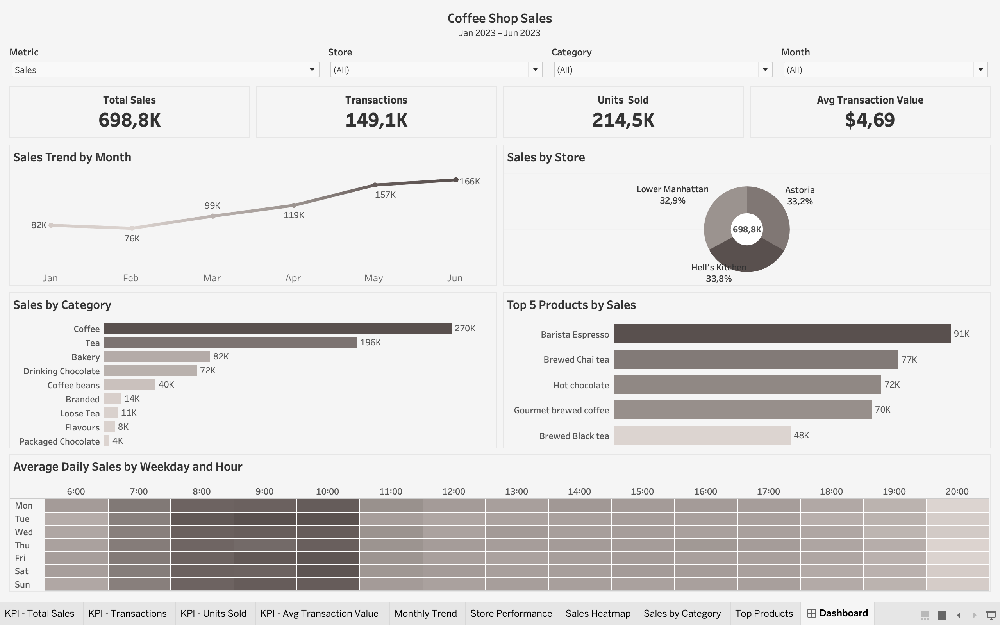

# Coffee Shop satışlarının təhlili - Tableau dashboard

Bu layihədə 2023-cü ilin yanvar-iyun aylarına aid satış məlumatları Tableau vasitəsilə təhlil edilib. Dashboard satış performansını, mağazalar və məhsullar üzrə nəticələri, həmçinin gün və saatlara görə dəyişiklikləri izləməyə imkan verir.

## Layihənin məqsədi

- Əsas satış göstəricilərini vahid dashboard-da təqdim etmək
- Mağazaların və məhsul kateqoriyalarının performansını müqayisə etmək
- Aylıq satış dinamikasını və pik satış vaxtlarını müəyyənləşdirmək
- Əməliyyat və məhsul planlaması üçün məlumat əsaslı qərarları dəstəkləmək

## Əsas göstəricilər

| Göstərici | Nəticə |
| --- | ---: |
| Analiz dövrü | Yanvar-iyun 2023 |
| Əməliyyat sayı | 149 116 |
| Satılan məhsul sayı | 214 470 |
| Ümumi satış | $698 812,33 |
| Orta əməliyyat dəyəri | $4,69 |
| Mağaza sayı | 3 |
| Məhsul kateqoriyası | 9 |

## Məlumatların hazırlanması

Məlumat mənbəyi kimi `Coffee_Shop_Sales_tableau_exam.xlsx` faylından istifadə olunub. Təhlil üçün aşağıdakı hesablanan sahələr yaradılıb:

- `Sales` - satılan miqdar × vahid qiyməti
- `Month` - əməliyyatın ayı
- `Day of Week` - həftənin günü
- `Hour` - əməliyyatın saatı
- `Avg Transaction Value` - ümumi satış ÷ əməliyyat sayı

NULL dəyərlər, təkrarlanan qeydlər, mənfi qiymətlər və mənfi satış miqdarları yoxlanılıb.

## Dashboard-un əsas hissələri

| Bölmə | Məqsəd |
| --- | --- |
| KPI kartları | Ümumi satış, əməliyyat sayı, satılan məhsul sayı və orta əməliyyat dəyəri |
| Aylıq satış dinamikası | Satışların aylar üzrə dəyişməsinin izlənməsi |
| Mağaza performansı | Üç mağazanın nəticələrinin müqayisəsi |
| Satış istilik xəritəsi | Gün və saatlara görə satış intensivliyinin göstərilməsi |
| Kateqoriyalar üzrə satış | Məhsul kateqoriyalarının satışdakı payının təhlili |
| Ən çox satılan məhsullar | Yüksək nəticə göstərən məhsulların sıralanması |

## İnteraktiv imkanlar

- Mağaza, məhsul kateqoriyası və tarix üzrə filtrləmə
- Həftənin günü və saat üzrə təhlil
- Satış, əməliyyat sayı, satılan məhsul sayı və orta əməliyyat dəyəri arasında keçid
- Vizual seçimlər vasitəsilə digər qrafiklərin avtomatik yenilənməsi

## Analitik istifadə sahələri

- Pik gün və saatlara uyğun işçi planlaması
- Mağazalar arasındakı performans fərqlərinin müəyyənləşdirilməsi
- Məhsul çeşidi və stok planlamasının təkmilləşdirilməsi
- Aylıq satış dəyişikliklərinin izlənməsi
- Yüksək nəticə göstərən məhsulların və kateqoriyaların müəyyənləşdirilməsi

## İstifadə olunan alətlər

- Tableau
- Microsoft Excel
- Calculated Fields
- Parameters və Filters

## Fayllar

- [Məlumat dəstini aç](./Coffee_Shop_Sales_tableau_exam.xlsx)
- [Tableau dashboard-unu aç](./Final_Project_Coffeeshop.twbx)

## Dashboard görünüşü

## Bacarıqlar

`Tableau` · `Data Visualization` · `Calculated Fields` · `Parameters` · `Filters` · `Business Analysis`
